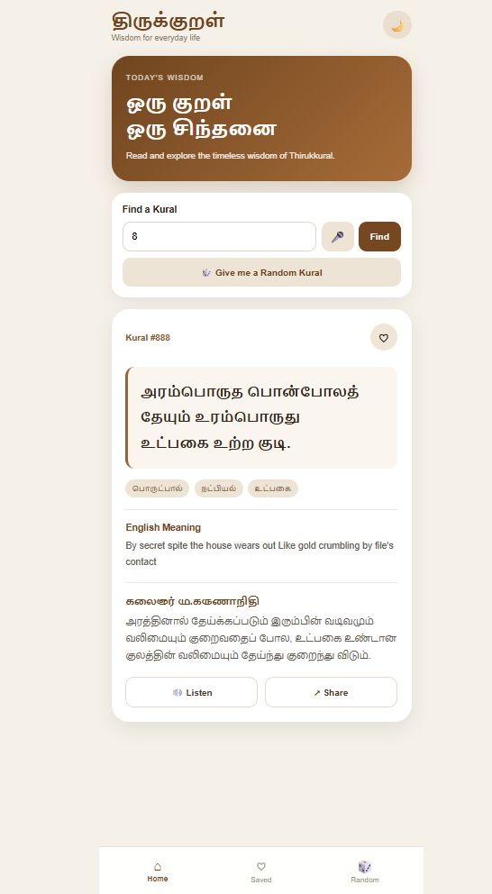
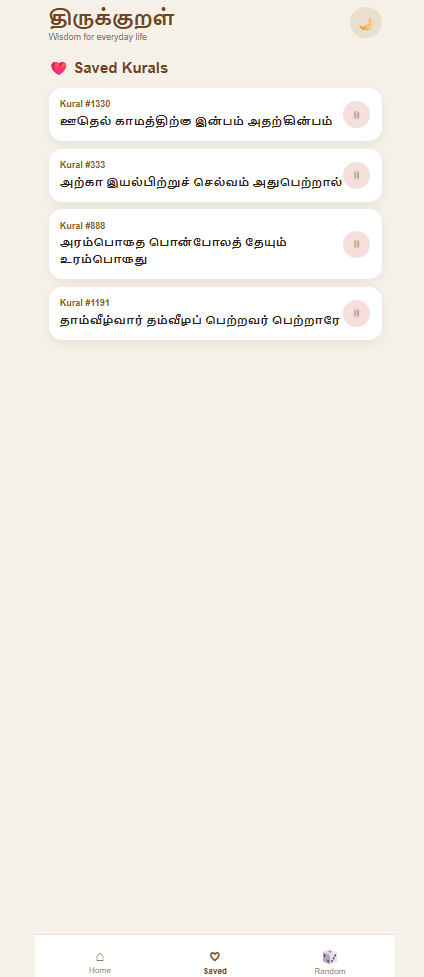

# Thirukkural App 📖

A modern, mobile-friendly Flask web application that brings the timeless wisdom of **Thirukkural** into an interactive experience.

## ✨ Features

- 🔎 Search Kural by number
- 🎲 Random Kural
- ❤️ Save favourite Kurals
- 🌙 Light / Dark mode
- 🔊 Listen using Text-to-Speech
- 📤 Share Kural
- 📱 Responsive mobile UI
- 🔌 Thirukkural API integration
- 🚫 No SQL database

## 🛠️ Built With

- Python
- Flask
- HTML
- CSS
- JavaScript
- REST API

## 🔄 How It Works

```text
User
 ↓
Flask App
 ↓
Thirukkural API
 ↓
JSON Response
 ↓
Web UI
```

## 📸 Screenshots

### Home — Light Mode



### Saved Kurals



### Home — Dark Mode


## 🚀 Run Locally

```bash
pip install -r requirements.txt
python app.py
```

Open:

```text
http://127.0.0.1:5000
```

## 🔌 API

This project uses the Thirukkural API:

https://thirukkural.docs.apiary.io/

## 📌 Future Improvements

- Search Kurals by keywords
- Browse chapters
- Kural of the Day
- PWA / Offline support
- Improved Tamil voice support

> **ஒரு குறள் — ஒரு சிந்தனை — ஒரு நல்ல மாற்றம்.**
